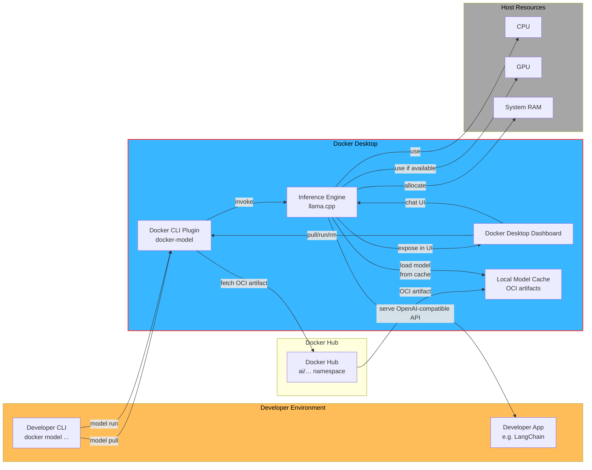

# Docker_Athens_Meetup_2025_May
Docker Athens Meetup Presentation on docker runners embedded to VSCode Continue Extension

What are Docker Model Runners, so how they run as containers, what images are currently available and after that show the PoC with Continue extension and model running on top to create a Cursor like IDE.  

## Continue promt example: 

- Create me inside @test.py a fastapi hello world example. Can you also add tags for each endpoint?


## Graph on how Model Runner Feature works:




## Presentation flow:

Enable Docker model runners
In the Continue desktop app, turn on the “Docker model runners” feature.

(Optional) Restart the engine
– Not needed in our setup, but generally you’d restart the engine after enabling new features.

Install the Continue extension
Download and install the “Continue” extension for your IDE or editor.

Create your config.yaml
Path: 

```bash
~/​.continue/config.yaml (on macOS: /Users/<USER_NAME>/.continue/config.yaml)
```

Pull a model via Docker CLI

```bash
docker model pull <model>
– Browse available models on Docker Hub: https://hub.docker.com/u/ai
```

Example:

```bash
docker model pull ai/mistral
```
(You can also pull Hugging Face models if you prefer.)

Register the model in config.yaml
Under models:, add:

models:
  - name: docker_athens_qwen
    provider: openai
    model: ai/llama3.2:1B-Q8_0
    apiBase: http://localhost:12434/engines/llama.cpp/v1
    roles:
      - chat
      - edit
      - apply
Add the model to Continue
In the Continue UI, click the three-dots menu → box icon, then fill in the form fields with your model’s details.

Create a FastAPI starter (main.py)

```python
from fastapi import FastAPI

app = FastAPI()

@app.get("/")
def read_root():
    return {"message": "hello docker athens"}
```

Run your FastAPI app

```bash
uvicorn main:app --host 0.0.0.0 --port 8000
```