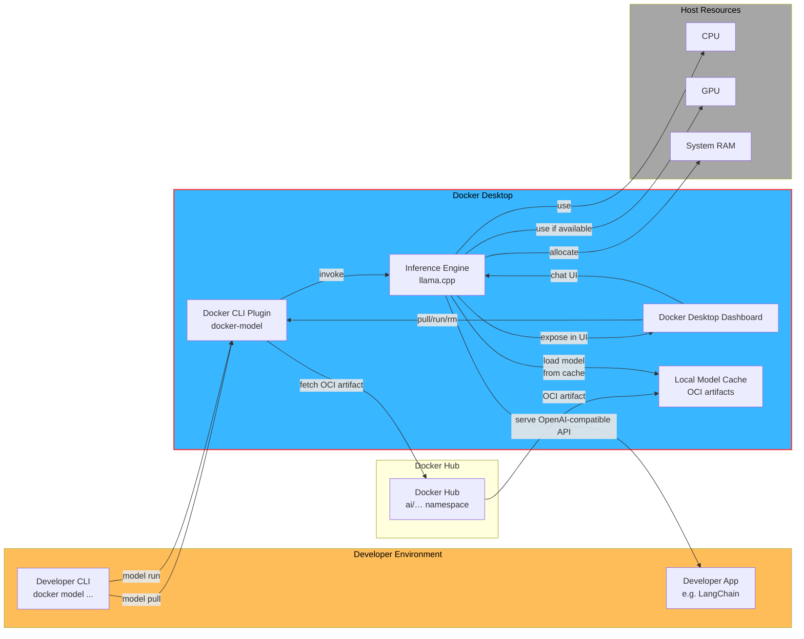

# Docker_Athens_Meetup_2025_May
Docker Athens Meetup Presentation on docker runners embedded to VSCode Continue Extension

What are Docker Model Runners, so how they run as containers, what images are currently available and after that show the PoC with Continue extension and model running on top to create a Cursor like IDE.  

## Continue promt example: 

- Create me inside @test.py a fastapi hello world example. Can you also add tags for each endpoint?

## Graph on how Model Runner Feature works:

